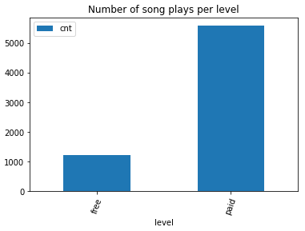

# Sparkify Data Modelling

## Sparkify

Sparkify is a learning project which aims at analyzing collected data from songs and user activity on a music streaming app. Analysts want to understand what songs users are listening to. Currently, they don't have an easy way to query their data, which resides in a directory of JSON logs on user activity on the app, as well as a directory with JSON metadata on the songs in their app.


## Datasets

### Songs Dataset

The first dataset is a subset of real data from the [Million Song Dataset](http://millionsongdataset.com). Each file is in JSON format and contains metadata about a song and the artist of that song. The files are partitioned by the first three letters of each song's track ID.

### Logs Dataset

The second dataset consists of log files in JSON format generated by this event simulator based on the songs in the dataset above. These simulate activity logs from a music streaming app based on specified configurations. The log files in the dataset are partitioned by year and month.


## How to run the scripts

In order to run the scripts you need to have [postgres](https://www.postgresql.org/download/) installed on your system and a 'student' role which has a CREATEDB permission.

To create database tables of the schema `python3 create_tables.py`
This script establishes a connection to DB, drops all tables, creates them again with the schema identified in (sql_queries)[sql_queries.py] script, and closes the DB connection.  

To run the etl script and process the datasets `python3 etl.py`
This script establishes a connection to DB, recursively iterates over songs files, processes both songs and logs dataset, inserts them into tables, and closes the DB connection,


## Schema

The following schema is following the [star schema](https://en.wikipedia.org/wiki/Star_schema) concept for DWHs. It is efficient for storing data and quering it in a relational DB.   


## Example queries

### - What are the top 3 songs played by each gender?
```
SELECT title, gender, cnt
FROM (
    SELECT title, gender, cnt, row_number() over (partition by gender order by cnt desc) rn 
    FROM (
            SELECT songs.title, users.gender, count(*) cnt
            FROM songplays 
            JOIN users on songplays.user_id = users.user_id
            JOIN songs on songplays.song_id = songs.song_id
            GROUP BY songs.title, users.gender
    ) t
) t
where rn <= 3;
```

### - What are the song plays for each level?
```
SELECT level, COUNT(*) cnt 
FROM songplays 
GROUP BY level;
```




## Sanity Checks

You can use the [test notebook](test.ipynb) for applying some sanity checks on the schema, data types, and applied constraints. 
Notebook cells should run with no warning messages printed if the schema is implemented accroding to specifications.
